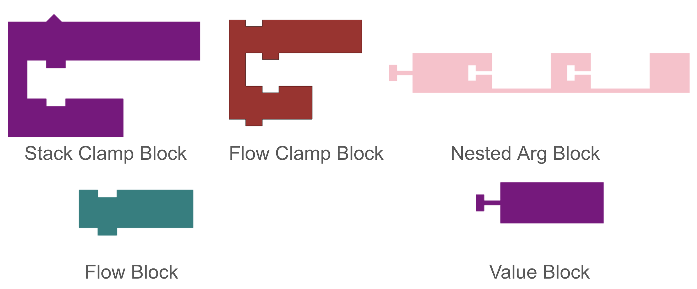
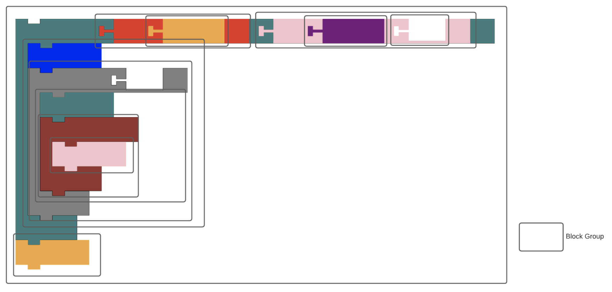
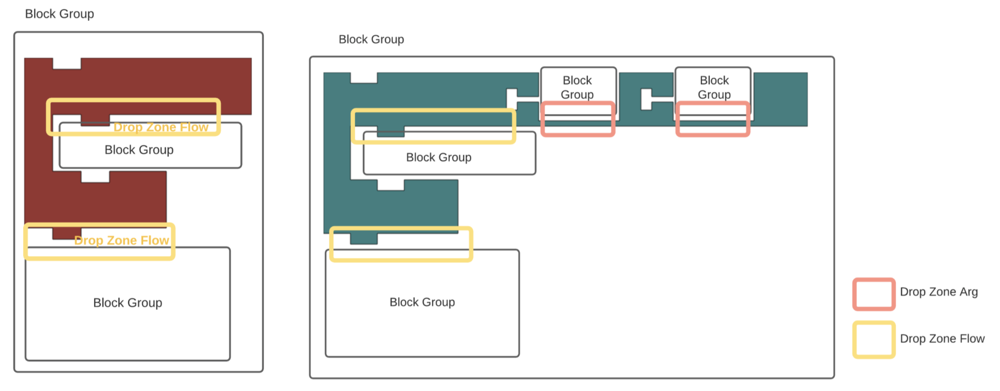

# Learning Bricks - A Novel Blocks Framework for Visual Programming Languages

Tech Stack - TypeScript, React, Redux, D3, Quadtree

## Introduction

Learning Bricks is a client side JavaScript framework for visual programming tools. Unlike traditional text based programming, visual programming provides a smoother learning curve for children and beginners as different components in the code could be visualised as UI elements and easily interacted with. In contrast to popular existing libraries and frameworks for visual programming, Learning Bricks is less opinionated, easily customisable, lightweight and performant. Learning Bricks was original developed for Music Blocks v4 but could me easily customised to cater to the needs of any project. Music Blocks is a Visual Programming Language and collection of manipulative tools for exploring musical and mathematical concepts in an integrative and fun way. This project is an effort towards the complete overhaul of MusicBlocks for performance improvements and new features and leverages modern JavaScript technologies and a better application architecture to ensure a smooth and reliable user experience.

## Types of Blocks

## Achitecture

Block Groups play a crucial role in rendering the blocks and managing their state and events associated to them. Each Block Group renders a single block and other block groups associated with that block.

The below diagram shows all the block groups in a block stack.

Apart from rendering other associated Block Groups, a Block Group also creates drop zones, these drop zones are not present in the DOM but their coodinates are stored in one of the two quadtrees that maintain position of horizontal and vertical drop zones respectively.

The below diagram shows block groups and drop zones for different block stacks.

